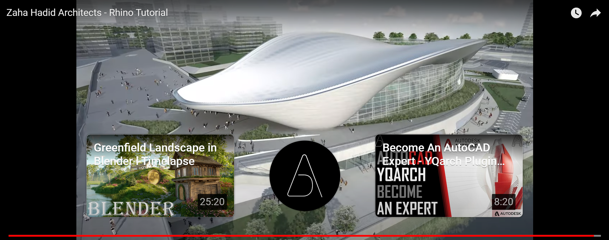

# Rhinoceros subD Tutorial 01

Zaha Hadid Architects の London Aquatics Centre を題材に Rhino の subD の操作に慣れるためのチュートリアル。

以下の 2 点を実施する。

1. London Aquatics Centre 屋根とカーテンウォールを Rhinoceros 上で表現する
2. 作成したモデルを 3D プリンターで出力する

## 用意するもの

- Rhinoceros をインストールした PC
- Ultimaker Cura をインストールした PC
- 3D プリンター

## 事前準備

architizer.com[^1]より London Aquatics Centre London, United Kingdom の図面を取得する。

設計したザハ・ハディッド[^2]や、エンジニアとして参画している Arup のサイト[^3]を訪れてみるのも良い。

a+u 2012 年 8 月号 pp.30-33 に掲載されているが、情報は少ない。Arup のサイトで記事を読むことをお勧めする。

## トレース

以下の動画を参考に図面から subD を作成する。

## 成果物

- [x] 3D プリンター用 GCODE`./3dmodel/AKGO_roof_1.1000_raft.gcode`
- [x] 3D モデルファイル`./3dmodel/roof_n_wall_1.1000.stl`
- [x] Rhinoceros ファイル`./rhino/LondonAquaticsCentre.3dm`
- [x] [作成したモデルのターンテーブルアニメーション](https://otaka44.github.io/rhino-subd-01/)

[^1]: https://architizer.com/projects/london-aquatics-centre/
[^2]: https://www.zaha-hadid.com/architecture/london-aquatics-centre/
[^3]: https://www.arup.com/ja-jp/projects/london-2012-aquatics-centre
